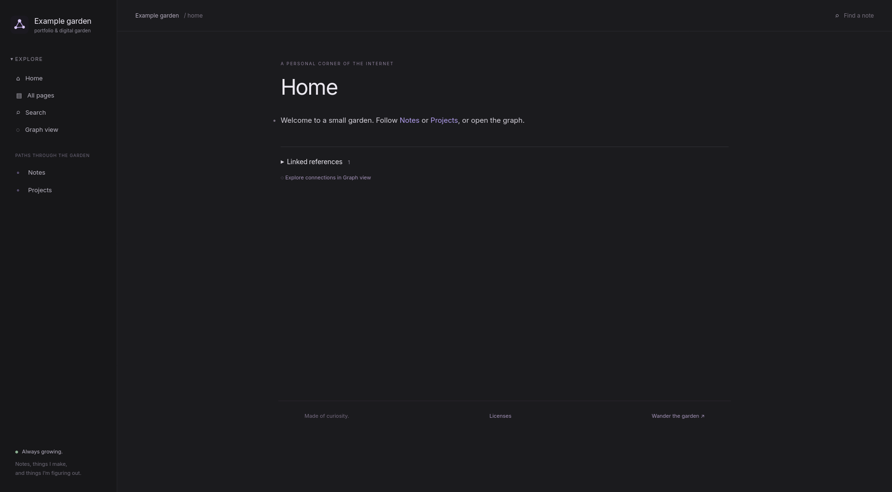

# logseq-static-garden

Turn a Logseq public export into a website that opens like a website.

Every note is rendered to HTML before deployment. Visitors get outlines, linked
pages, search, and an interactive graph without loading Logseq, SQLite, or WASM.
Built for **Logseq 2.0.1 DB graphs → Export public pages**.

[Live example: Arney's garden](https://arney-garden.pages.dev) · [Exporter guide](static-garden/README.md) · [Contributing](CONTRIBUTING.md)

<!-- Screenshot: add docs/images/homepage.png here, using the fictional example garden. -->


## What carries over

- Nested outlines with native collapse controls, properties, tags, and backlinks.
- Page and block references, plus inline page and block embeds.
- Code highlighting and equations rendered during the build.
- A graph with pan, zoom, search, and a view of a page's neighbors.
- Full-text search that downloads its index only when someone searches.
- Responsive navigation and larger graph touch targets on phones.
- YouTube video macros, images, audio, and downloadable attachments.

Page content and navigation work without JavaScript. Search and the graph use
small, separate browser scripts. This is a reading site: Logseq editing, plugins,
and live queries are not included.

## Try it

Requires Python 3.10+ with venv support and Node.js. No npm install.

```sh
./build-static.sh --source examples/minimal --output dist
python3 -m http.server 8000 --directory dist
```

Open [localhost:8000](http://localhost:8000). The example contains fictional notes,
links, code, an equation, and an embedded page. You do not need anyone else's graph
to work on the renderer.

## Build your own garden

Export public pages from Logseq into a separate directory. Put a `site.json` next
to that export's `index.html`, using [this example](examples/minimal/site.json).
Set `home_page` to an existing public page and `url` to your website's full URL.

```sh
./build-static.sh --source /path/to/my-garden --output /path/to/my-garden/dist
```

For your own logo, put `logo.svg` and a 512×512 `logo.png` in the export directory's
`branding/` folder. Otherwise the generic graph logo is used. Configuration and
branding belong to the garden; renderer changes belong here.

Publish **only `dist/`**, never the raw export directory. Any static host can serve
the HTML. Cloudflare Pages also applies the generated `_headers` security rules;
other hosts need equivalent response headers. URLs currently assume the site is
served at the domain root, not a repository subpath.

For an automated build, keep a pinned copy of this tool in your site's repository
or have CI check out an exact commit. Avoid building against a moving branch if
you want updates to be deliberate. [Arney's garden](https://github.com/Arney1/garden)
uses a checked-in snapshot and keeps its usual export → commit → push workflow.

## How it works

```text
public export → Transit decoder → HTML + CSS + JS → static hosting
```

Python renders content, Markdown, and highlighted code. Node.js runs bundled KaTeX
to produce MathML and calculates graph positions. Only referenced attachments are
copied. Search and graph data are generated once during the build.

Each build reports page counts, file sizes, and unsupported content in
`dist-report.json`, beside the output directory. The exporter reads only the public
export; it does not open your private Logseq database.

## Contributing

Bug fixes, rendering improvements, and tests are welcome. Use the fictional
example or a small synthetic fixture for reproductions; please don't submit your
personal export. See [CONTRIBUTING.md](CONTRIBUTING.md) for commands and boundaries.

This project began in [Arney1/garden](https://github.com/Arney1/garden). Existing
contributions, including Kerim's page and block embed support, are credited in
[AUTHORS.md](AUTHORS.md).

## License

[MIT](licenses/MIT.txt) for original software, documentation, and examples.
Dependencies retain their [own notices](THIRD_PARTY_NOTICES.md). Publishing content
with this tool does not change that content's license. This is an unofficial
project and is not endorsed by Logseq.
